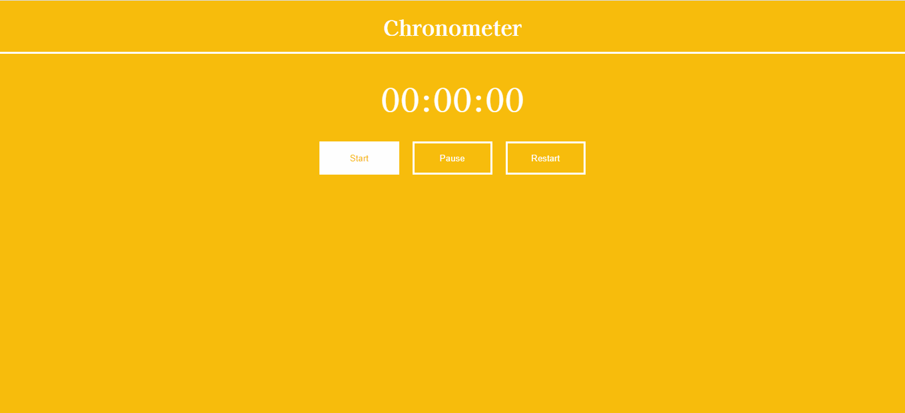

<h1 align="center">Chronometer</h1>

This is a chronometer website made wit pure HTML, CSS and JavaScript

Summary
===========
<!--ts-->
  * [About](#about)
  * [Screenshot](#screenshot)
  * [How to use](#how-to-use)
  * [Status](#status)
  * [Features](#features)
  * [Technologies](#technologies)
  * [Author](#author)
<!--te-->

About
-----
I builded this project to improve my JavaScript skills, and challenger myself to learn more how to manipulate time with JavaScript.

Screenshot
----------

How to use
----------

To run this chronometer you will only need to open the HTML in a browser.

You can start the chronometer with the start button, for start to counting the time.

You can stop the chronometer with the pause button, for stop counting time. If you click in start, the chronometer will countinue count from when it stopped.

You can restart the chronometer to zero with the restart button.For start to count again you need to click on the start button.

The chronometer count minutes, seconds and milliseconds.

Status
------
Concluded :heavy_check_mark:

Features
--------
- [x] Count minutes, seconds and milliseconds
- [x] Pause the counting
- [x] Restart the chronometer
- [ ] Count hours

Technologies
------------
- [HTML](https://html.com/)
- [CSS](https://www.w3.org/Style/CSS/Overview.en.html)
- [JavaScript](https://www.javascript.com/)

Author
------
<h3 align="center">Rafael Tavares</h3>

 <a href="https://www.facebook.com/rafael.tavares.39904/"></img></a>
 <a href="https://www.instagram.com/rafatavares03/"></img></a>

